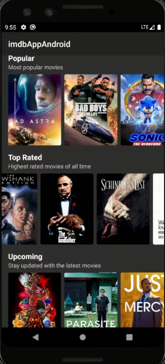

# imbd-app-android

Uma aplicação em Kotlin utilizando a api do OMDb (www.omdbapi.com) que lista os filmes mais bem avaliados, mais populares atualmente e os que irão lançar.

**Bibliotecas Utilizadas**

*Retrofit*: Biblioteca para fazer as requisições da API.

*Gson*: Biblioteca converter JSON em objetos.

*Glide*: Biblioteca para fazer o carregamento de imagens.

**Tela inicial da aplicação:**

  
